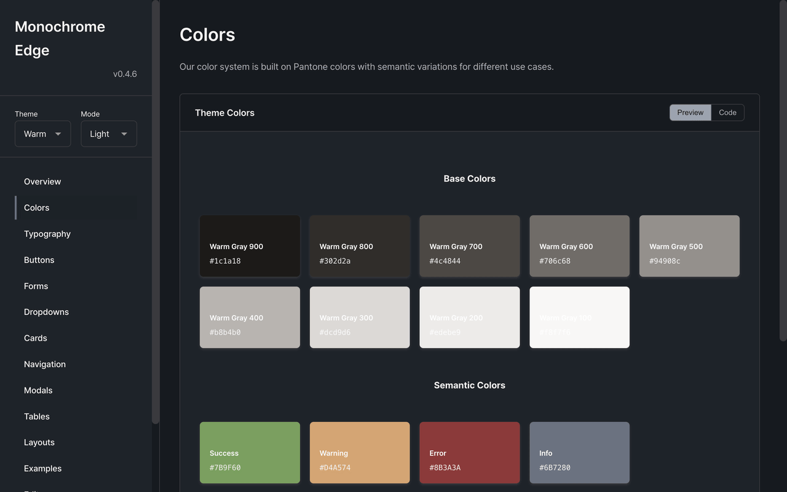

# Monochrome Edge

A modern, minimalist UI component library with dual-theme system for web applications.

[](https://1eedaegon.github.io/monochrome-edge/)
[](https://www.npmjs.com/package/@monochrome-edge/ui)
[](LICENSE)
[](https://www.jsdelivr.com/package/npm/@monochrome-edge/ui)



## Demo

Check out demo : **[Monochrome Edge](https://1eedaegon.github.io/monochrome-edge/)**

## Overview

Monochrome Edge provides a comprehensive set of UI components built with pure CSS. The library features a sophisticated dual-theme system (Warm/Cold) with automatic light/dark mode support and animated landscape backgrounds.

## Installation

### NPM

```bash
npm install @monochrome-edge/ui
```

### CDN (jsDelivr)

```html
<!-- CSS only -->
<link rel="stylesheet" href="https://cdn.jsdelivr.net/npm/@monochrome-edge/ui@latest/dist/monochrome.min.css">
```


## Quick Start

### CSS Import

```html
<!-- CDN -->
<link rel="stylesheet" href="https://cdn.jsdelivr.net/npm/@monochrome-edge/ui@latest/dist/monochrome.min.css">

<!-- Or use specific version -->
<link rel="stylesheet" href="https://cdn.jsdelivr.net/npm/@monochrome-edge/ui@1.0.6/dist/monochrome.min.css">
```

### Basic Usage

```html
<!DOCTYPE html>
<html data-theme-variant="warm" data-theme="light">
<head>
  <link rel="stylesheet" href="https://cdn.jsdelivr.net/npm/@monochrome-edge/ui@latest/dist/monochrome.min.css">
</head>
<body>
  <!-- Button -->
  <button class="btn btn-primary">Primary Button</button>
  
  <!-- Card -->
  <div class="card">
    <div class="card-header">
      <h3 class="card-title">Card Title</h3>
    </div>
    <div class="card-body">
      Card content
    </div>
  </div>
  
  <!-- Landscape Background -->
  <div class="b-landscape b-landscape-wave"></div>
</body>
</html>
```

## Theme System

### Setting Theme Variant

```html
<!-- Warm theme (default) -->
<html data-theme-variant="warm">

<!-- Cold theme -->
<html data-theme-variant="cold">
```

### Dark Mode

```html
<!-- Light mode (default) -->
<html data-theme="light">

<!-- Dark mode -->
<html data-theme="dark">

<!-- System preference -->
<html data-theme="auto">
```

## Component Structure

### Atomic Design System

```
atoms/          Basic building blocks
├── button      Interactive elements
├── input       Form controls
├── badge       Status indicators
└── typography  Text styles

molecules/      Composite components
├── card        Content containers
├── dropdown    Select menus
├── form-group  Input groups
└── search-bar  Search interface

organisms/      Complex UI sections
├── header      Page headers
├── sidebar     Navigation panels
├── modal       Dialog windows
└── data-table  Data grids

templates/      Page layouts
├── dashboard   Admin layouts
├── landing     Marketing pages
└── app         Application shells
```

## Key Features

### Landscape Backgrounds

Animated background components for visual depth:

```html
<!-- Wave Pattern -->
<div class="b-landscape b-landscape-wave"></div>

<!-- Mountain Pattern -->
<div class="b-landscape b-landscape-mountain"></div>

<!-- Forest Pattern -->
<div class="b-landscape b-landscape-forest"></div>

<!-- Desert Pattern -->
<div class="b-landscape b-landscape-desert"></div>
```

**Colored Mode:**
```html
<!-- Enable colored mode -->
<div class="b-landscape b-landscape-wave" data-landscape-mode="colored"></div>
```

### Buttons

```html
<button class="btn btn-primary">Primary</button>
<button class="btn btn-secondary">Secondary</button>
<button class="btn btn-ghost">Ghost</button>
<button class="btn btn-danger">Danger</button>
```

### Cards

```html
<div class="card">
  <div class="card-header">
    <h3 class="card-title">Title</h3>
  </div>
  <div class="card-body">
    Content goes here
  </div>
</div>
```

### Tabs

```html
<div class="tabs">
  <div class="tabs-list">
    <button class="tab active">Tab 1</button>
    <button class="tab">Tab 2</button>
    <button class="tab">Tab 3</button>
  </div>
</div>
```

## CSS Variables

### Core Tokens

```css
:root {
  /* Colors */
  --theme-bg: /* Dynamic based on theme */
  --theme-surface: /* Dynamic based on theme */
  --theme-accent: /* Dynamic based on theme */

  /* Typography */
  --font-family-sans: system-ui, -apple-system, sans-serif
  --font-size-base: 16px

  /* Spacing */
  --spacing-xs: 0.25rem
  --spacing-sm: 0.5rem
  --spacing-md: 1rem
  --spacing-lg: 1.5rem
  --spacing-xl: 2rem

  /* Borders */
  --border-radius-sm: 4px
  --border-radius-md: 8px
  --border-radius-lg: 12px
}
```

## Browser Support

- Chrome 90+
- Firefox 88+
- Safari 14+
- Edge 90+

## Build from Source

```bash
# Clone repository
git clone https://github.com/1eedaegon/monochrome-edge.git

# Install dependencies
npm install

# Development server
npm run dev

# Build production
npm run build
```

## Component Classes

### Button Variants

- `.btn-primary` - Primary action button
- `.btn-secondary` - Secondary action button
- `.btn-ghost` - Subtle ghost button
- `.btn-danger` - Destructive action button

### Button Sizes

- `.btn-small` - Small button
- `.btn-large` - Large button

### Landscape Backgrounds

- `.b-landscape-wave` - Animated wave pattern
- `.b-landscape-mountain` - Mountain silhouette
- `.b-landscape-forest` - Forest scene
- `.b-landscape-desert` - Desert dunes

**Attributes:**
- `data-landscape-mode="colored"` - Enable colored theme-aware mode
- Default: monochrome (grayscale)

## License

[MIT](LICENSE)

## Contributing

See [CONTRIBUTING.md](CONTRIBUTING.md) for development guidelines.

## Links

- [Documentation](DEVELOPMENT.md)
- [GitHub](https://github.com/1eedaegon/monochrome-edge)
- [npm](https://www.npmjs.com/package/@monochrome-edge/ui)
- [jsDelivr CDN](https://www.jsdelivr.com/package/npm/@monochrome-edge/ui)
