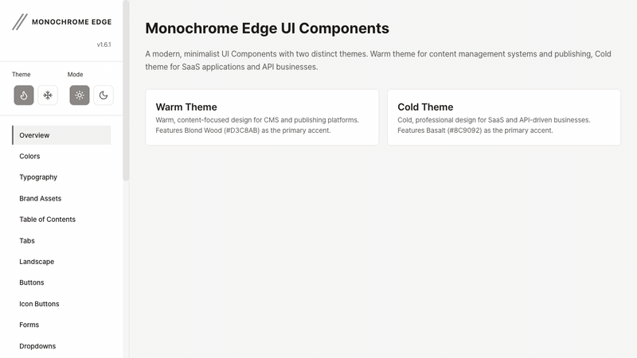

# Monochrome Edge

A modern, minimalist UI component library with dual-theme system for web applications.

[](https://1eedaegon.github.io/monochrome-edge/)
[](https://www.npmjs.com/package/@monochrome-edge/ui)
[](LICENSE)
[](https://www.jsdelivr.com/package/npm/@monochrome-edge/ui)



## Demo

Check out demo : **[Monochrome Edge](https://1eedaegon.github.io/monochrome-edge/)**

## Overview

Monochrome Edge provides a comprehensive set of UI components with both **CSS-only** and **interactive JavaScript** components. The library features a sophisticated dual-theme system (Warm/Cold) with automatic light/dark mode support and animated landscape backgrounds.

## Installation & Quick Start

### 📦 Option 1: npm (Recommended for Production)

**Install**
```bash
npm install @monochrome-edge/ui
```

**CSS Only Usage**
```javascript
// Import CSS in your entry file
import '@monochrome-edge/ui/css';
```

**CSS + JavaScript Components (TypeScript)**
```typescript
// Import CSS
import '@monochrome-edge/ui/css';

// Import components
import { Modal, Toast, Accordion, Tabs, Dropdown } from '@monochrome-edge/ui';

// Use components
const modal = new Modal('#myModal', {
  closeOnBackdrop: true,
  closeOnEscape: true
});

Toast.success('Hello World!');

const accordion = new Accordion('#myAccordion', {
  allowMultiple: false
});
```

**Framework Examples**

<details>
<summary><strong>React</strong></summary>

```jsx
// App.js
import '@monochrome-edge/ui/css';
import { useEffect } from 'react';
import { Modal, Toast } from '@monochrome-edge/ui';

function App() {
  useEffect(() => {
    const modal = new Modal('#myModal');
    return () => modal.destroy();
  }, []);

  return (
    <div>
      <button className="btn btn-primary" onClick={() => modal.open()}>
        Open Modal
      </button>
      <button className="btn btn-success" onClick={() => Toast.success('Success!')}>
        Show Toast
      </button>
    </div>
  );
}
```
</details>

<details>
<summary><strong>Vue</strong></summary>

```vue
<script setup>
import '@monochrome-edge/ui/css';
import { onMounted, onUnmounted } from 'vue';
import { Modal, Toast } from '@monochrome-edge/ui';

let modal;

onMounted(() => {
  modal = new Modal('#myModal');
});

onUnmounted(() => {
  modal?.destroy();
});
</script>

<template>
  <button class="btn btn-primary" @click="modal.open()">Open Modal</button>
  <button class="btn btn-success" @click="Toast.success('Success!')">Show Toast</button>
</template>
```
</details>

<details>
<summary><strong>Next.js</strong></summary>

```jsx
// _app.js or layout.js
import '@monochrome-edge/ui/css';

export default function App({ Component, pageProps }) {
  return <Component {...pageProps} />;
}

// components/MyModal.js
'use client';
import { useEffect } from 'react';
import { Modal } from '@monochrome-edge/ui';

export default function MyModal() {
  useEffect(() => {
    const modal = new Modal('#myModal');
    return () => modal.destroy();
  }, []);
  
  return <div id="myModal" className="modal">...</div>;
}
```
</details>

---

### 🌐 Option 2: CDN (Quick Prototyping)

**Complete Example (CSS + JS)**
```html
<!DOCTYPE html>
<html data-theme-variant="warm" data-theme="light">
<head>
  <meta charset="UTF-8">
  <meta name="viewport" content="width=device-width, initial-scale=1.0">
  <title>Monochrome Edge Demo</title>
  
  <!-- CSS -->
  <link rel="stylesheet" href="https://cdn.jsdelivr.net/npm/@monochrome-edge/ui@latest/dist/monochrome.min.css">
</head>
<body>
  <!-- CSS Components (No JS Required) -->
  <button class="btn btn-primary">Primary Button</button>
  
  <div class="card">
    <div class="card-header">
      <h3 class="card-title">Card Title</h3>
    </div>
    <div class="card-body">Card content here</div>
  </div>

  <!-- JavaScript Components -->
  
  <!-- Accordion -->
  <div class="accordion" id="myAccordion">
    <div class="accordion-item">
      <div class="accordion-header">Section 1</div>
      <div class="accordion-content"><p>Content 1</p></div>
    </div>
    <div class="accordion-item">
      <div class="accordion-header">Section 2</div>
      <div class="accordion-content"><p>Content 2</p></div>
    </div>
  </div>

  <!-- Modal -->
  <button onclick="modal.open()">Open Modal</button>
  <div class="modal" id="myModal">
    <div class="modal-content">
      <div class="modal-header">
        <h3>Modal Title</h3>
        <button class="modal-close" data-modal-close>&times;</button>
      </div>
      <div class="modal-body">
        <p>Modal content goes here</p>
      </div>
      <div class="modal-footer">
        <button class="btn btn-secondary" onclick="modal.close()">Cancel</button>
        <button class="btn btn-primary" onclick="modal.close()">OK</button>
      </div>
    </div>
  </div>

  <!-- Tabs -->
  <div class="tabs" id="myTabs">
    <div class="tabs-header">
      <button class="tab active">Tab 1</button>
      <button class="tab">Tab 2</button>
      <button class="tab">Tab 3</button>
    </div>
    <div class="tabs-content">
      <div class="tab-panel active"><p>Content 1</p></div>
      <div class="tab-panel"><p>Content 2</p></div>
      <div class="tab-panel"><p>Content 3</p></div>
    </div>
  </div>

  <!-- Toast Buttons -->
  <button class="btn btn-success" onclick="MonochromeEdge.Toast.success('Success!')">
    Success Toast
  </button>
  <button class="btn btn-danger" onclick="MonochromeEdge.Toast.error('Error!')">
    Error Toast
  </button>

  <!-- Dropdown -->
  <button class="btn btn-secondary" id="dropdownBtn">Actions ▼</button>
  <div class="dropdown-menu">
    <a href="#" class="dropdown-item">Action 1</a>
    <a href="#" class="dropdown-item">Action 2</a>
    <div class="dropdown-divider"></div>
    <a href="#" class="dropdown-item">Another Action</a>
  </div>

  <!-- JavaScript Bundle -->
  <script src="https://cdn.jsdelivr.net/npm/@monochrome-edge/ui@latest/dist/ui.js"></script>
  
  <!-- Initialize Components -->
  <script>
    // All components available via MonochromeEdge namespace
    const accordion = new MonochromeEdge.Accordion('#myAccordion', {
      allowMultiple: false,
      defaultOpen: [0]
    });

    const modal = new MonochromeEdge.Modal('#myModal', {
      closeOnBackdrop: true,
      closeOnEscape: true
    });

    const tabs = new MonochromeEdge.Tabs('#myTabs', {
      defaultTab: 0
    });

    const dropdown = new MonochromeEdge.Dropdown('#dropdownBtn', {
      closeOnSelect: true
    });

    console.log('All components initialized!');
  </script>
</body>
</html>
```

> ⚠️ **Note**: CDN usage may cause animation flickering on icon-buttons due to network latency. For production, we recommend npm installation.

## Theme System

### Setting Theme Variant

```html
<!-- Warm theme (default) -->
<html data-theme-variant="warm">

<!-- Cold theme -->
<html data-theme-variant="cold">
```

### Dark Mode

```html
<!-- Light mode (default) -->
<html data-theme="light">

<!-- Dark mode -->
<html data-theme="dark">

<!-- System preference -->
<html data-theme="auto">
```

## Component Structure

### Atomic Design System

```
atoms/          Basic building blocks
├── button      Interactive elements
├── input       Form controls
├── badge       Status indicators
└── typography  Text styles

molecules/      Composite components
├── card        Content containers
├── dropdown    Select menus
├── form-group  Input groups
└── search-bar  Search interface

organisms/      Complex UI sections
├── header      Page headers
├── sidebar     Navigation panels
├── modal       Dialog windows
└── data-table  Data grids

templates/      Page layouts
├── dashboard   Admin layouts
├── landing     Marketing pages
└── app         Application shells
```

## Key Features

### Landscape Backgrounds

Animated background components for visual depth:

```html
<!-- Wave Pattern -->
<div class="b-landscape b-landscape-wave"></div>

<!-- Mountain Pattern -->
<div class="b-landscape b-landscape-mountain"></div>

<!-- Forest Pattern -->
<div class="b-landscape b-landscape-forest"></div>

<!-- Desert Pattern -->
<div class="b-landscape b-landscape-desert"></div>
```

**Colored Mode:**
```html
<!-- Enable colored mode -->
<div class="b-landscape b-landscape-wave" data-landscape-mode="colored"></div>
```

### Buttons

```html
<button class="btn btn-primary">Primary</button>
<button class="btn btn-secondary">Secondary</button>
<button class="btn btn-ghost">Ghost</button>
<button class="btn btn-danger">Danger</button>
```

### Cards

```html
<div class="card">
  <div class="card-header">
    <h3 class="card-title">Title</h3>
  </div>
  <div class="card-body">
    Content goes here
  </div>
</div>
```

### Tabs

```html
<div class="tabs">
  <div class="tabs-list">
    <button class="tab active">Tab 1</button>
    <button class="tab">Tab 2</button>
    <button class="tab">Tab 3</button>
  </div>
</div>
```

## Advanced Components

### Available Interactive Components

The library includes advanced JavaScript components for complex interactions:

- **Accordion**: Collapsible content panels with single/multiple open support
- **Modal**: Dialog windows with backdrop and keyboard navigation
- **Tabs**: Tab navigation with programmatic switching
- **Toast**: Notification system (success, error, info, warning)
- **Dropdown**: Contextual menus with auto-positioning
- **SearchBar**: Full-text search with autocomplete
- **SearchToolbar**: Advanced search with filters and sorting
- **TreeView**: Hierarchical tree navigation
- **GraphView**: Canvas-based graph visualization  
- **Stepper**: Multi-step progress indicator
- **MathRenderer**: LaTeX math equation rendering

See the [live documentation](https://1eedaegon.github.io/monochrome-edge/) for detailed API references and interactive examples.

## CSS Variables

### Core Tokens

```css
:root {
  /* Colors */
  --theme-bg: /* Dynamic based on theme */
  --theme-surface: /* Dynamic based on theme */
  --theme-accent: /* Dynamic based on theme */

  /* Typography */
  --font-family-sans: system-ui, -apple-system, sans-serif
  --font-size-base: 16px

  /* Spacing */
  --spacing-xs: 0.25rem
  --spacing-sm: 0.5rem
  --spacing-md: 1rem
  --spacing-lg: 1.5rem
  --spacing-xl: 2rem

  /* Borders */
  --border-radius-sm: 4px
  --border-radius-md: 8px
  --border-radius-lg: 12px
}
```

## Browser Support

- Chrome 90+
- Firefox 88+
- Safari 14+
- Edge 90+

## Build from Source

```bash
# Clone repository
git clone https://github.com/1eedaegon/monochrome-edge.git

# Install dependencies
npm install

# Development server
npm run dev

# Build production
npm run build
```

## Component Classes

### Button Variants

- `.btn-primary` - Primary action button
- `.btn-secondary` - Secondary action button
- `.btn-ghost` - Subtle ghost button
- `.btn-danger` - Destructive action button

### Button Sizes

- `.btn-small` - Small button
- `.btn-large` - Large button

### Landscape Backgrounds

- `.b-landscape-wave` - Animated wave pattern
- `.b-landscape-mountain` - Mountain silhouette
- `.b-landscape-forest` - Forest scene
- `.b-landscape-desert` - Desert dunes

**Attributes:**
- `data-landscape-mode="colored"` - Enable colored theme-aware mode
- Default: monochrome (grayscale)

## License

[MIT](LICENSE)

## Contributing

See [CONTRIBUTING.md](CONTRIBUTING.md) for development guidelines.

## Links

- [Documentation](DEVELOPMENT.md)
- [GitHub](https://github.com/1eedaegon/monochrome-edge)
- [npm](https://www.npmjs.com/package/@monochrome-edge/ui)
- [jsDelivr CDN](https://www.jsdelivr.com/package/npm/@monochrome-edge/ui)
