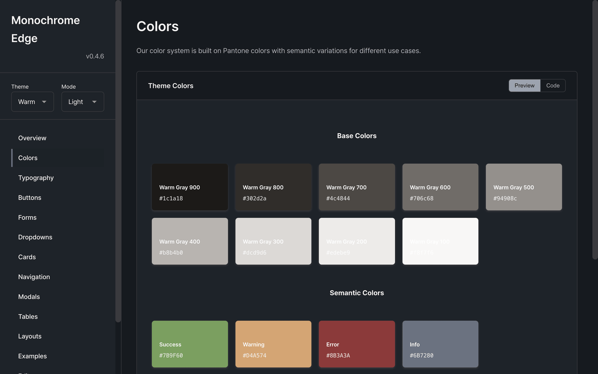

# Monochrome Edge

A modern, minimalist UI component library with dual-theme system for web applications.

[](https://1eedaegon.github.io/monochrome-edge/)
[](https://www.npmjs.com/package/@monochrome-edge/ui)
[](LICENSE)
[](https://www.jsdelivr.com/package/npm/@monochrome-edge/ui)



## Demo

Live demos on GitHub Pages:

- **[Components](https://1eedaegon.github.io/monochrome-edge/)** — full component gallery, both themes
- **[Integration Guide](https://1eedaegon.github.io/monochrome-edge/integration-guide.html)** — CDN / npm / per-framework setup
- **[Blog Demo](https://1eedaegon.github.io/monochrome-edge/blog-demo.html)** — editorial layout in context
- **[Block Editor](https://1eedaegon.github.io/monochrome-edge/editor.html)** — WYSIWYG editor _(WIP)_

## Overview

Monochrome Edge provides a comprehensive set of UI components with both **CSS-only** and **interactive JavaScript** components. The library features a sophisticated dual-theme system (Warm/Cold) with automatic light/dark mode support and animated landscape backgrounds.

## Installation & Quick Start

### Option 1: npm (Recommended for Production)

**Install**
```bash
npm install @monochrome-edge/ui
```

**CSS Only Usage**
```javascript
// Import CSS in your entry file
import '@monochrome-edge/ui/css';
```

**CSS + JavaScript Components (TypeScript)**
```typescript
// Import CSS
import '@monochrome-edge/ui/css';

// Import components
import { Modal, Toast, Accordion, Tabs, Dropdown } from '@monochrome-edge/ui';

// Use components
const modal = new Modal('#myModal', {
  closeOnBackdrop: true,
  closeOnEscape: true
});

Toast.success('Hello World!');

const accordion = new Accordion('#myAccordion', {
  allowMultiple: false
});
```

**Framework Examples**

<details>
<summary><strong>React</strong></summary>

Use the dedicated React adapter — idiomatic components, no imperative `new`:

```jsx
// App.jsx
import '@monochrome-edge/ui/css';
import { useState } from 'react';
import { ThemeProvider, Modal, Button, useToast } from '@monochrome-edge/ui/react';

function App() {
  const [open, setOpen] = useState(false);
  const toast = useToast();

  return (
    <ThemeProvider defaultTheme="warm" defaultMode="light">
      <Button variant="primary" onClick={() => setOpen(true)}>Open Modal</Button>
      <Button variant="secondary" onClick={() => toast.success('Success!')}>
        Show Toast
      </Button>

      <Modal isOpen={open} onClose={() => setOpen(false)} title="Hello">
        Modal content goes here.
      </Modal>
    </ThemeProvider>
  );
}
```

Interactive components (`Accordion`, `Tabs`, `Dropdown`, `SearchBar`, `SearchToolbar`,
`TreeView`, `Stepper`, `Math`, `GraphView`, `TOC`) are exported from the same entry and
wrap the canonical vanilla classes:

```jsx
import { TreeView, SearchBar } from '@monochrome-edge/ui/react';

<TreeView data={treeData} onNodeClick={(node) => console.log(node.label)} />
<SearchBar documents={docs} onSelect={(doc) => open(doc.url)} />
```
</details>

<details>
<summary><strong>Vue</strong></summary>

Use the dedicated Vue adapter:

```vue
<script setup>
import '@monochrome-edge/ui/css';
import { ref } from 'vue';
import { ThemeProvider, Modal, Button, TreeView } from '@monochrome-edge/ui/vue';

const open = ref(false);
const treeData = ref([{ id: 'src', label: 'src', children: [] }]);
</script>

<template>
  <ThemeProvider default-theme="warm" default-mode="light">
    <Button variant="primary" @click="open = true">Open Modal</Button>
    <Modal :is-open="open" :title="'Hello'" @close="open = false">
      Modal content goes here.
    </Modal>
    <TreeView :data="treeData" @node-click="(n) => console.log(n.label)" />
  </ThemeProvider>
</template>
```
</details>

<details>
<summary><strong>Next.js</strong></summary>

Import the CSS once in the root layout, then use the React adapter in Client Components:

```jsx
// app/layout.jsx
import '@monochrome-edge/ui/css';

export default function RootLayout({ children }) {
  return <html><body>{children}</body></html>;
}

// components/MyModal.jsx
'use client';
import { useState } from 'react';
import { Modal, Button } from '@monochrome-edge/ui/react';

export default function MyModal() {
  const [open, setOpen] = useState(false);
  return (
    <>
      <Button variant="primary" onClick={() => setOpen(true)}>Open</Button>
      <Modal isOpen={open} onClose={() => setOpen(false)} title="Modal">
        Content
      </Modal>
    </>
  );
}
```

> The interactive wrappers touch the DOM, so keep them in Client Components (`'use client'`).
</details>

<details>
<summary><strong>jQuery</strong></summary>

Importing the jQuery entry registers chainable `$.fn.mce*` plugins:

```js
import '@monochrome-edge/ui/css';
import $ from 'jquery';
import '@monochrome-edge/ui/jquery'; // registers $.fn.mce* plugins

$('#myModal').mceModal({ closeOnBackdrop: true });
$('#save').mceButton({ variant: 'primary' });
$('#tabs').mceTabs({ defaultTab: 0 });
```

Plugins: `mceButton`, `mceCard`, `mceModal`, `mceTabs`, `mceAccordion`,
`mceToast`, `mceTheme`, `mceIconToggle`, `mceBreadcrumb`.
</details>

<details>
<summary><strong>Web Components (framework-agnostic)</strong></summary>

Importing the entry auto-registers `<mce-*>` custom elements — drop them into
plain HTML or any framework's template:

```js
import '@monochrome-edge/ui/css';
import '@monochrome-edge/ui/web-components'; // registers <mce-*> elements
```

```html
<mce-button variant="primary">Save</mce-button>
<mce-modal id="m" title="Hello">Content</mce-modal>
<mce-tree-view></mce-tree-view>
```

Registered: `mce-button`, `mce-card`, `mce-modal`, `mce-tabs`, `mce-accordion`,
`mce-input`, `mce-checkbox`, `mce-badge`, `mce-toast`, `mce-icon-toggle`,
`mce-breadcrumb`, `mce-tree-view`, `mce-graph-view`, `mce-search-toolbar`, `mce-toc`.
</details>

**Which entry fits my stack?**

| Stack | Import | What you get |
| --- | --- | --- |
| Vanilla TS/JS (bundler) | `@monochrome-edge/ui` | Canonical classes — `new Modal(...)`, `Toast.success(...)` |
| React / Next.js | `@monochrome-edge/ui/react` | Idiomatic components + `useToast`; keep DOM wrappers in Client Components |
| Vue 3 | `@monochrome-edge/ui/vue` | `defineComponent` wrappers with props/events |
| jQuery | `@monochrome-edge/ui/jquery` | Chainable `$.fn.mce*` plugins |
| Any / no framework | `@monochrome-edge/ui/web-components` | `<mce-*>` custom elements |
| CDN `<script>` | `dist/ui.js` (UMD) | Global `MonochromeEdge.*` namespace |

Every entry ships both **ESM (`import`) and CommonJS (`require`)** conditions plus
TypeScript declarations, and is **SSR/SSG-safe** (guards `document`/`window`) — so it
works under Next.js, Nuxt, Astro, VitePress, Remix and friends without a "window is
not defined" crash.

---

### Option 2: CDN (Quick Prototyping)

**Complete Example (CSS + JS)**
```html
<!DOCTYPE html>
<html data-theme-variant="warm" data-theme="light">
<head>
  <meta charset="UTF-8">
  <meta name="viewport" content="width=device-width, initial-scale=1.0">
  <title>Monochrome Edge Demo</title>
  
  <!-- CSS -->
  <link rel="stylesheet" href="https://cdn.jsdelivr.net/npm/@monochrome-edge/ui@latest/dist/monochrome.min.css">
</head>
<body>
  <!-- CSS Components (No JS Required) -->
  <button class="btn btn-primary">Primary Button</button>
  
  <div class="card">
    <div class="card-header">
      <h3 class="card-title">Card Title</h3>
    </div>
    <div class="card-body">Card content here</div>
  </div>

  <!-- JavaScript Components -->
  
  <!-- Accordion -->
  <div class="accordion" id="myAccordion">
    <div class="accordion-item">
      <div class="accordion-header">Section 1</div>
      <div class="accordion-content"><p>Content 1</p></div>
    </div>
    <div class="accordion-item">
      <div class="accordion-header">Section 2</div>
      <div class="accordion-content"><p>Content 2</p></div>
    </div>
  </div>

  <!-- Modal -->
  <button onclick="modal.open()">Open Modal</button>
  <div class="modal" id="myModal">
    <div class="modal-content">
      <div class="modal-header">
        <h3>Modal Title</h3>
        <button class="modal-close" data-modal-close>&times;</button>
      </div>
      <div class="modal-body">
        <p>Modal content goes here</p>
      </div>
      <div class="modal-footer">
        <button class="btn btn-secondary" onclick="modal.close()">Cancel</button>
        <button class="btn btn-primary" onclick="modal.close()">OK</button>
      </div>
    </div>
  </div>

  <!-- Tabs -->
  <div class="tabs" id="myTabs">
    <div class="tabs-header">
      <button class="tab active">Tab 1</button>
      <button class="tab">Tab 2</button>
      <button class="tab">Tab 3</button>
    </div>
    <div class="tabs-content">
      <div class="tab-panel active"><p>Content 1</p></div>
      <div class="tab-panel"><p>Content 2</p></div>
      <div class="tab-panel"><p>Content 3</p></div>
    </div>
  </div>

  <!-- Toast Buttons -->
  <button class="btn btn-success" onclick="MonochromeEdge.Toast.success('Success!')">
    Success Toast
  </button>
  <button class="btn btn-danger" onclick="MonochromeEdge.Toast.error('Error!')">
    Error Toast
  </button>

  <!-- Dropdown -->
  <button class="btn btn-secondary" id="dropdownBtn">Actions ▼</button>
  <div class="dropdown-menu">
    <a href="#" class="dropdown-item">Action 1</a>
    <a href="#" class="dropdown-item">Action 2</a>
    <div class="dropdown-divider"></div>
    <a href="#" class="dropdown-item">Another Action</a>
  </div>

  <!-- JavaScript Bundle -->
  <script src="https://cdn.jsdelivr.net/npm/@monochrome-edge/ui@latest/dist/ui.js"></script>
  
  <!-- Initialize Components -->
  <script>
    // All components available via MonochromeEdge namespace
    const accordion = new MonochromeEdge.Accordion('#myAccordion', {
      allowMultiple: false,
      defaultOpen: [0]
    });

    const modal = new MonochromeEdge.Modal('#myModal', {
      closeOnBackdrop: true,
      closeOnEscape: true
    });

    const tabs = new MonochromeEdge.Tabs('#myTabs', {
      defaultTab: 0
    });

    const dropdown = new MonochromeEdge.Dropdown('#dropdownBtn', {
      closeOnSelect: true
    });

    console.log('All components initialized!');
  </script>
</body>
</html>
```

> **Note**: Hot-path icons (toolbar, theme toggle, common UI) are inlined into the
> bundle, so there's no first-paint icon flicker. Less-common icons still lazy-load
> from the CDN on demand. For fully self-hosted/offline control, prefer npm install.

## Theme System

### Setting Theme Variant

```html
<!-- Warm theme (default) -->
<html data-theme-variant="warm">

<!-- Cold theme -->
<html data-theme-variant="cold">
```

### Dark Mode

```html
<!-- Light mode (default) -->
<html data-theme="light">

<!-- Dark mode -->
<html data-theme="dark">

<!-- System preference -->
<html data-theme="auto">
```

## Component Structure

### Atomic Design System

```
atoms/          Basic building blocks
├── button      Interactive elements
├── input       Form controls
├── badge       Status indicators
└── typography  Text styles

molecules/      Composite components
├── card        Content containers
├── dropdown    Select menus
├── form-group  Input groups
└── search-bar  Search interface

organisms/      Complex UI sections
├── header      Page headers
├── sidebar     Navigation panels
├── modal       Dialog windows
└── data-table  Data grids

templates/      Page layouts
├── dashboard   Admin layouts
├── landing     Marketing pages
└── app         Application shells
```

## Key Features

### Landscape Backgrounds

Animated background components for visual depth:

```html
<!-- Wave Pattern -->
<div class="b-landscape b-landscape-wave"></div>

<!-- Mountain Pattern -->
<div class="b-landscape b-landscape-mountain"></div>

<!-- Forest Pattern -->
<div class="b-landscape b-landscape-forest"></div>

<!-- Desert Pattern -->
<div class="b-landscape b-landscape-desert"></div>
```

**Colored Mode:**
```html
<!-- Enable colored mode -->
<div class="b-landscape b-landscape-wave" data-landscape-mode="colored"></div>
```

### Buttons

```html
<button class="btn btn-primary">Primary</button>
<button class="btn btn-secondary">Secondary</button>
<button class="btn btn-ghost">Ghost</button>
<button class="btn btn-danger">Danger</button>
```

### Cards

```html
<div class="card">
  <div class="card-header">
    <h3 class="card-title">Title</h3>
  </div>
  <div class="card-body">
    Content goes here
  </div>
</div>
```

### Tabs

```html
<div class="tabs">
  <div class="tabs-list">
    <button class="tab active">Tab 1</button>
    <button class="tab">Tab 2</button>
    <button class="tab">Tab 3</button>
  </div>
</div>
```

## Advanced Components

### Available Interactive Components

The library includes advanced JavaScript components for complex interactions:

- **Accordion**: Collapsible content panels with single/multiple open support
- **Modal**: Dialog windows with backdrop and keyboard navigation
- **Tabs**: Tab navigation with programmatic switching
- **Toast**: Notification system (success, error, info, warning)
- **Dropdown**: Contextual menus with auto-positioning
- **SearchBar**: Full-text search with autocomplete
- **SearchToolbar**: Advanced search with filters and sorting
- **TreeView**: Hierarchical tree navigation
- **GraphView**: Canvas-based graph visualization  
- **Stepper**: Multi-step progress indicator
- **MathRenderer**: LaTeX math equation rendering

See the [live documentation](https://1eedaegon.github.io/monochrome-edge/) for detailed API references and interactive examples.

## CSS Variables

### Core Tokens

```css
:root {
  /* Colors */
  --theme-bg: /* Dynamic based on theme */
  --theme-surface: /* Dynamic based on theme */
  --theme-accent: /* Dynamic based on theme */

  /* Typography */
  --font-family-sans: system-ui, -apple-system, sans-serif
  --font-size-base: 16px

  /* Spacing */
  --spacing-xs: 0.25rem
  --spacing-sm: 0.5rem
  --spacing-md: 1rem
  --spacing-lg: 1.5rem
  --spacing-xl: 2rem

  /* Borders */
  --border-radius-sm: 4px
  --border-radius-md: 8px
  --border-radius-lg: 12px
}
```

## Browser Support

- Chrome 90+
- Firefox 88+
- Safari 14+
- Edge 90+

## Build from Source

```bash
# Clone repository
git clone https://github.com/1eedaegon/monochrome-edge.git

# Install dependencies
npm install

# Development server
npm run dev

# Build production
npm run build
```

## Component Classes

### Button Variants

- `.btn-primary` - Primary action button
- `.btn-secondary` - Secondary action button
- `.btn-ghost` - Subtle ghost button
- `.btn-danger` - Destructive action button

### Button Sizes

- `.btn-small` - Small button
- `.btn-large` - Large button

### Landscape Backgrounds

- `.b-landscape-wave` - Animated wave pattern
- `.b-landscape-mountain` - Mountain silhouette
- `.b-landscape-forest` - Forest scene
- `.b-landscape-desert` - Desert dunes

**Attributes:**
- `data-landscape-mode="colored"` - Enable colored theme-aware mode
- Default: monochrome (grayscale)

## Documentation

- **[ARCHITECTURE.md](ARCHITECTURE.md)** — system design: token/theme layers, the vanilla-TS behavior pattern, adapter architecture, build pipeline, and release model.
- **[COMPONENTS.md](COMPONENTS.md)** — full component API reference: markup, options, methods, events, and the per-framework availability matrix for every component.
- **[INTEGRATION.md](INTEGRATION.md)** — usage guide: zero-install CDN, shadcn-style vendoring, npm exports, runtime theming, and React/Vue/jQuery/Web-Components/SSR recipes.
- **[ui/components/editor/ARCHITECTURE.md](ui/components/editor/ARCHITECTURE.md)** — the block editor subsystem.
- **[DEVELOPMENT.md](DEVELOPMENT.md)** · **[CONTRIBUTING.md](CONTRIBUTING.md)** — local development and contribution guidelines.

## License

[MIT](LICENSE)

## Contributing

See [CONTRIBUTING.md](CONTRIBUTING.md) for development guidelines.

## Links

- [Architecture](ARCHITECTURE.md) · [Components](COMPONENTS.md) · [Integration](INTEGRATION.md) · [Development](DEVELOPMENT.md)
- [GitHub](https://github.com/1eedaegon/monochrome-edge)
- [npm](https://www.npmjs.com/package/@monochrome-edge/ui)
- [jsDelivr CDN](https://www.jsdelivr.com/package/npm/@monochrome-edge/ui)
